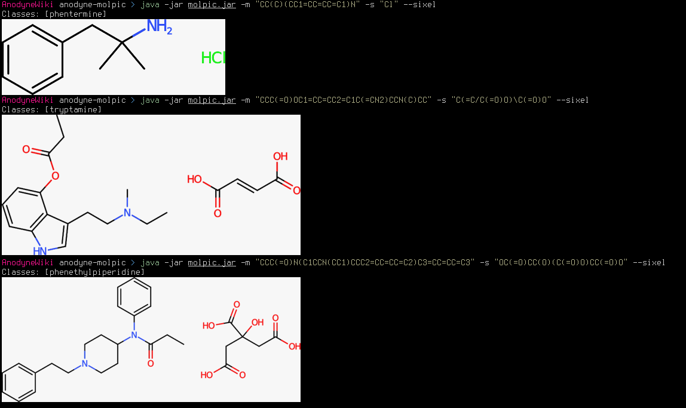

# Molpic



### Usage
```shell
gradle jar

java -jar molpic.jar -v -m "CC(C)(CC1=CC=CC=C1)N" -o phentermine.svg
java -jar molpic.jar -v -m "CC(C)(CC1=CC=CC=C1)N" -s "Cl" -o phentermine_hydrochloride.svg
java -jar molpic.jar -v -m "CC(C)(CC1=CC=CC=C1)N" -s "Cl" -ac 2 -o phentermine_dihydrochloride.svg
java -jar molpic.jar -v -m "CC(C)(CC1=CC=CC=C1)N" -s "Cl" -am 2 -o phentermine_hemihydrochloride.svg
```

### Dependencies
- Chemistry Development Kit (CDK) 2.11 — `org.openscience.cdk:*`
- Beam (SMILES backend) — `uk.ac.ebi.beam:beam-core`
- vecmath (2D/3D coordinate math) — `javax.vecmath:vecmath`
- Commons CLI — `commons-cli:commons-cli`
- Groovy 3.0.25 — `org.codehaus.groovy:groovy`
